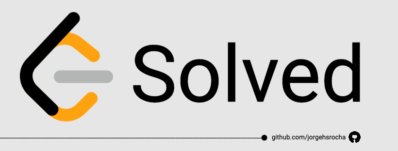

# What's this ? 
It's my repository with solutions of leetcode's questions. 🤓

## How the project was organized ?
The repository has file's strutucture with all questions solved by me. Each filename follow the name pattern: 
`[number_of_question].[title_of_problem].[extension_of_language]`

## Follow me on Leetcode ♥️
https://leetcode.com/u/jorgehsrocha/
